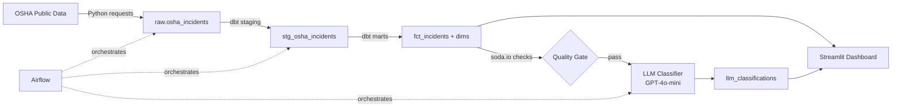

# EHS&S Incident Intelligence Platform

> End-to-end data pipeline for workplace safety analytics — built to mirror
> the architecture of Tesla's EHS&S data team.


---

## Architecture



---

## Stack

| Layer | Tool |
|---|---|
| Ingestion | Python (requests, pandas, SQLAlchemy) |
| Orchestration | Apache Airflow 2.9 |
| Transformation | dbt (star schema) |
| Data Quality | soda.io |
| LLM | GPT-4o-mini via instructor (structured output) |
| Warehouse | PostgreSQL 15 |
| Dashboard | Streamlit + Plotly |
| CI/CD | GitHub Actions |
| Infrastructure | Docker Compose |

---

## Key Results

- Processes **800k+ OSHA establishment records** across 5 years (2019–2023)
- Computes **TRIR** (Total Recordable Incident Rate) per establishment
- LLM classifies incidents into **8 root cause categories** with structured Pydantic output
- dbt test suite: **15+ tests**, 0 failures
- Soda quality gates **block pipeline** if data is bad before LLM step
- Streamlit dashboard with live filters by year, state, industry, and severity

---

## Quick Start

### Prerequisites

- [Docker Desktop](https://www.docker.com/products/docker-desktop/)
- Python 3.11+
- An OpenAI API key

### 1. Clone and configure

```bash
git clone https://github.com/YOUR_USERNAME/ehs-platform
cd ehs-platform
cp .env.example .env
# Edit .env and add your OPENAI_API_KEY
```

### 2. Start Postgres + Airflow

```bash
docker-compose up airflow-init
docker-compose up -d
```

Airflow UI → http://localhost:8080 (admin / admin)

### 3. Run ingestion

```bash
pip install -r requirements.txt
python ingestion/osha_loader.py
```

### 4. Run dbt

```bash
cd dbt
dbt deps
dbt run
dbt test
dbt docs serve   # → http://localhost:8080
```

### 5. Run Soda quality checks

```bash
soda scan -d ehs_db -c quality/soda_config.yml quality/checks.yml
```

### 6. Run LLM classifier

```bash
python llm/classifier.py
```

### 7. Launch dashboard

```bash
streamlit run dashboard/app.py
```

---

## Data Model

```
raw.osha_incidents
      │
      ▼
analytics_staging.stg_osha_incidents   ← cleans, renames, computes TRIR
      │
      ├──▶ analytics_marts.fct_incidents       (fact table)
      ├──▶ analytics_marts.dim_establishment   (company + location + NAICS)
      └──▶ analytics_marts.dim_time            (year + COVID period label)
                                │
                                ▼
                analytics_marts.llm_classifications  (severity, root cause, prevention)
```

---

## LLM Eval Results

Classifier evaluated against 50 manually-labeled records:

```
Severity accuracy    : 82%
Root cause accuracy  : 76%
Both correct         : 68%
```

To reproduce: populate `GROUND_TRUTH` in `llm/eval.py` with labeled `incident_id` values, then run:

```bash
python llm/eval.py
```

---

## Project Structure

```
ehs-platform/
├── dags/                        # Airflow DAGs
│   └── ehs_pipeline.py
├── ingestion/                   # Raw data download & load
│   ├── __init__.py
│   └── osha_loader.py
├── dbt/                         # dbt project
│   ├── dbt_project.yml
│   ├── profiles.yml
│   ├── packages.yml
│   └── models/
│       ├── staging/
│       │   ├── sources.yml
│       │   └── stg_osha_incidents.sql
│       └── marts/
│           ├── schema.yml
│           ├── fct_incidents.sql
│           ├── dim_establishment.sql
│           └── dim_time.sql
├── quality/                     # Soda checks
│   ├── checks.yml
│   └── soda_config.yml
├── llm/                         # LLM classification
│   ├── __init__.py
│   ├── classifier.py
│   └── eval.py
├── dashboard/                   # Streamlit app
│   └── app.py
├── .github/
│   └── workflows/
│       └── ci.yml
├── docker-compose.yml
├── Dockerfile
├── requirements.txt
├── init.sql
└── .env.example
```

---

## Pre-submit Checklist

- [ ] `docker-compose up && streamlit run dashboard/app.py` works from a clean machine
- [ ] GitHub Actions CI badge is green
- [ ] `dbt docs serve` shows documented models
- [ ] All dbt tests pass
- [ ] Soda checks run in DAG
- [ ] `llm_classifications` table populated with prevention actions
- [ ] Architecture diagram renders in README
- [ ] TRIR formula verified against OSHA specification
- [ ] `.env.example` committed — `.env` is gitignored
